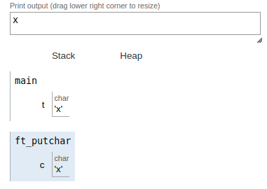

|||
|:-|:-|
|code||
|<pre> #include <unistd.h>   void  ft_putchar(char c);   int main(void)   {     char t;     t = 'x';     ft_putchar(t);   }   void  ft_putchar(char c)   {      write(1,&c,1);   }   </pre>||
