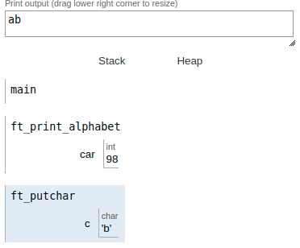

|||
|:--|:--|
|ft_print_alphabet||
|Files to turn in : ft_print_alphabet.c||
|Allowed functions : write||

 

- Create a function that displays the alphabet in lowercase, on a single line, by
ascending order, starting from the letter ’a’.

- Here’s how it should be prototyped :

<pre>  void ft_putchar(char c); </pre> 

### Operation:

We call the function from the main. 

When we are inside the function:
- There is declared a variable of integer type to which is given the value of 97 that corresponds to the character A of the ASCII table. 

- Within a while loop we call the `putchar` function to which we parameter the value of the character we want to display.

- And then increase the value by 1 in the integer variable.

 

The loop will end when the value of the integer variable equals 122. In this way we obtain the alphabet consecutively without line breaks.

|||
|:-|:-|
|code||
|<pre> #include <unistd.h>   #include <ft_putchar.h>     void  ft_print_alphabet(void);   int main(void)   {     ft_print_alphabet();   }   void  ft_print_alphabet(void)   {     int car;     car = 97;     while (car < 122)     {       ft_putchar(car);       car++;     }  }   </pre> ||
