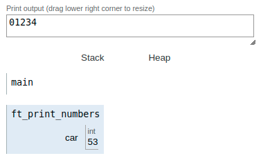

|||
|:--|:--|
|ft_print_numbers||
|Files to turn in : ft_print_numbers.c||
|Allowed functions : write||

 

- Create a function that displays all digits, on a single line, by ascending order.

- Here’s how it should be prototyped :

<pre>  void ft_print_numbers(void); </pre> 

### Operation:

Basically, the same operation that we have seen in previous exercises is repeated, in this case what varies is that instead of representing text characters what we see are numbers, but we must bear in mind that these numbers are text characters with their corresponding decimal value in ASCII.

 

The loop will end when the value of the integer variable equals 97. In this way we obtain the alphabet consecutively without line breaks.

|||
|:-|:-|
|code||
|<pre> #include <unistd.h>   #include <ft_putchar.h>     void  ft_print_numbers(void);   int main(void)   {     ft_print_numbers();   }   void  ft_print_numbers(void)   {     int car;     car = 48;     while (car < 58)     {       write(1,&car,1);       car++;     }  }   </pre> ||
