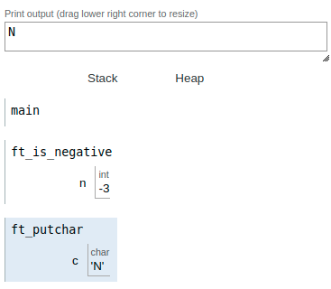

|||
|:--|:--|
|ft_is_negative||
|Files to turn in : ft_is_negative.c||
|Allowed functions : write||

 

- Create a function that displays ’N’ or ’P’ depending on the integer’s sign entered as a parameter. If n is negative, display ’N’. If n is positive or null, display ’P’.

- Here’s how it should be prototyped :

<pre>  void ft_is_negative(int n); </pre> 

### Operation:

 

|||
|:-|:-|
|code||
|<pre> #include <unistd.h>   #include <ft_putchar.h>     void  ft_is_negative(int n);;   int main(void)   {     ft_is_negative(-3);   }   void  ft_is_negative(void)   {     if (n >= 0)     {       ft_putchar('P');     }     else         ft_putchar('P');  }   </pre> ||
