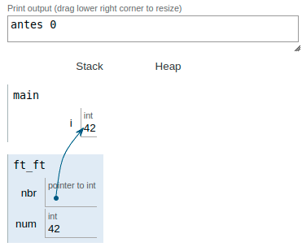

|||
|:--|:--|
|ft_ft||
|Files to turn in : ft_ft.c||
|Allowed functions : none||

 

- Write a function that takes a pointer to int as a parameter and gives the int the value of 42.

- Here’s how it should be prototyped :

<pre>  void  ft_ft(int *nbr); </pre> 

### Operation:

We declare a variable called `i` with an initial value of `0`.

The contents of that variable are printed only to see the change happening.

Call the function and **pass as an argument the memory address of the variable that we have initialized with the value of `0`**. 

One within the function, we are in the memory space reserved for it and we have: 

- The pointer declared as parameter `*nbr` that at that moment points to the memory direction of i because we had passed the memory address of i by arguments. 

- An integer variable with the value of `42`. 

- The key is assigning the value `42` of the num variable to the pointer `*nbr`, so we manage to modify the content of `i` in the main function. 

Working with the content of variables in this way is called a step-by-reference.

 

|||
|:-|:-|
|code||
|<pre> #include <unistd.h>   #include <stdio.h>    ft_ft(int   *nbr);  int main(void)   {    int i;   i = 0;   printf("antes %i", i);   ft_ft(&i);   printf("bef %i", i);   return (0);  }   void  ft_ft(int   *nbr)  {  int num;  num = 42;  *nbr = num;  }   </pre>||
