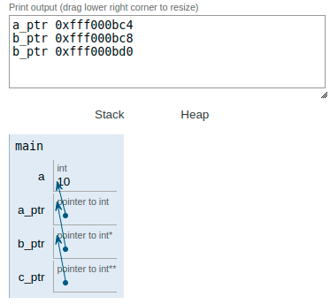

|||
|:--|:--|
|ft_ultimate_ft||
|Files to turn in : ft_ultimate_ft.c||
|Allowed functions : none||

 

- Write a function that takes pointer to pointer to pointer to pointer to punch- Teur on pointer on pointer on pointer on pointer on int en parameter and sets the int to 42.

- Here’s how it should be prototyped :

<pre>  void	ft_ultimate_ft(int *********nbr); </pre> 

### Operation:

To understand the exercise I have made this sketch. 

It is about creating a variable with a value and obtaining the memory address and creating a new pointer type variable that contains (point) to the previous variable and again create another pointer type variable that contains the memory address of the previous variable (that is, it is a pointer) to the variable. To be clear about what the exercise that asks us means because the resolution is simple but the concept behind it is important.

 

|||
|:-|:-|
|code||
|<pre>   int main(void)   {     int a;    a = 10;      int *a_ptr; // direccion memoria de a    int **b_ptr;    b_ptr = &a_ptr;    int ***c_ptr;    c_ptr = &b_ptr;      printf("a_ptr %p \n", a_ptr);    printf("b_ptr %p \n", b_ptr);    printf("b_ptr %p \n", c_ptr);      return (0);   }  </pre>||
