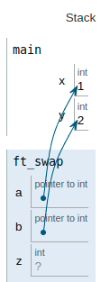
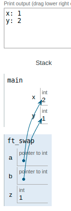

|||
|:--|:--|
|ft_swap||
|Files to turn in : ft_swap.c||
|Allowed functions : none||

 

- Write a function that swaps the contents of two integers whose addresses are data in parameters.

- Here’s how it should be prototyped :

<pre>  void ft_swap(int *a, int *b); </pre> 

### Operation:

In the main function we have declared and assigned two variables

When the function is called, the direction of the variables is passed through parameters

At that moment we have in the function, the memory address in which our variables of the main function are located.

 

|||
|:-|:-|
|code||
|<pre>   #include <unistd.h>   #include <stdio.h>   int main(void)   {    int x;    int y;    x = 1;    y = 2;    printf("x: %i", x);    write(1,"\n",1);    printf("y: %i", y);    write(1,"\n",1);      ft_swap(&x, &y);    printf("x: %i", x);    printf("y: %i", y);    write(1,"\n",1);    return (0);   }       void  ft_swap(int *a, int *b)   {    int z;    z = *a;    *a = *b;    *b = z;   } </pre>|  |

