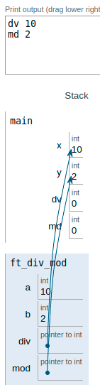
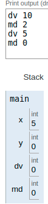

|||
|:--|:--|
|div_mod||
|Files to turn in : div_mod.c||
|Allowed functions : none||

 

- Write a ft_div_mod function that has the following prototyping:

- Here’s how it should be prototyped :

<pre>  void ft_div_mod(int a, int b, int *div, int *mod); </pre> 

### Operation:

In the main function we have declared and assigned two variables `x = 10` and `y = 2`

When the function is called, the direction of the variables is passed through parameters into the function.

At that moment we have in the function, the memory address in which our variables of the main function are located.

So we divide the value of A by B and assign it to the DIV pointing variable resulting in the modification of the value that we had previously initialized in main. Same with the operation of rest on the `*mod`

 

|||
|:-|:-|
|code||
|<pre>   #include <unistd.h>    #include <stdio.h>     void  ft_div_mod(int a, int b, int *div, int *mod);   void  ft_div_mod(int a, int b, int *div, int *mod)   {       *div = a/b;      *mod = a%b;  }      int main(void)   {      int x;    int y;    int dv;    int md;    int *pv_ptr;    int *md_ptr;      x = 10;     y = 2;       dv = 0;      md = 0;       printf("dv %i", x);     printf("md %i", y);        ft_div_mod(x, y, &x, &y);        printf("dv %i", x);     printf("md %i", y);       return (0);  }  </pre>|  |

