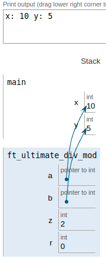
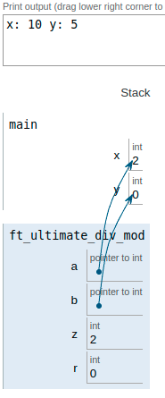
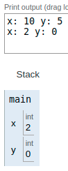

|||
|:--|:--|
|ft_ultimate_div_mod||
|Files to turn in : ft_ultimate_div_mod.c||
|Allowed functions : none||

 

- Write a ft_div_mod function that has the following prototyping:

<pre>  void	ft_ultimate_div_mod(int *a, int *b);</pre>

- This function divides the int **pointers by `a` and `b`**. 
- The result of the division is **stored in the int pointer by `a`**. 
- The result of the rest of the division is stored in the int denoted by `b`.

### Operation:

- In the main function there are declared and assigned two variables `x=10` and `y=5`.

- We pass to the function by its arguments the direction of those two variables (pointing)

- When entering the function (in its memory space) we have access to the memory position of the variables that we have passed to it when calling the function.

- Then we do the mathematical operations and save them in two variables of integer type that we will use as a buffer.

- The content of these variables is passed to the variables of type pointer that modify the values of the variables in the main function

- We have managed to make use of the pointers in both directions, operating with the values and then returning those modified values.

 

|||
|:-|:-|
|code||
|<pre>   #include <unistd.h>     #include <stdio.h>    void  ft_ultimate_div_mod(int *a, int *b);      int    main(void)             {      int x;        int y;      x = 10;      y = 5;              printf("x: %i ", x);      printf("y: %i \n", y);         ft_ultimate_div_mod(&x, &y);       printf("x: %i ", x);     printf("y: %i \n", y);       return (0);  }    void  ft_ultimate_div_mod(int *a, int *b)    {     int z;     int r;       z = *a/ *b;     r = *a%*b;      *a = z;    *b = r;   }</pre> |     |
