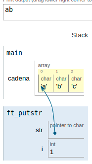
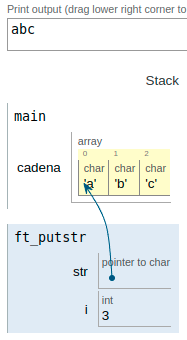
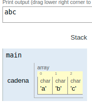

|||
|:--|:--|
|ft_putstr||
|Files to turn in : ft_putstr.c||
|Allowed functions : none||

 

- Write a function that displays a string of characters on the screen.

- Write a ft_div_mod function that has the following prototyping:

<pre>  void ft_putstr(char *str);</pre>

### Operation:

- In the main function we declare a string of characters and introduce it as an argument in the function.

- When we are in the inside of the function we have access to the pointer `*str` and an integer variable that will serve to act as a counter.

- The pointer has the initial address of the first position in the string and hrough the loop while and the condition of !='\0' the counter increases its value (pointer) and make that while moves it through the array of characters, printing on the screen at the same time.

 

|||
|:-|:-|
|code||
|<pre>   #include <unistd.h>  #include <stdio.h>    void  ft_putstr(char *str);    int main(void)  {    char cadena[3] = "abc";       ft_putstr(cadena);    write(1,"\n",1);    return (0);  }    void  ft_putstr(char *str)  {    int i;    i = 0;    while (str[i] != '\0')    {      write(1,&str[i],1);      i++;    }   } </pre> |    |
