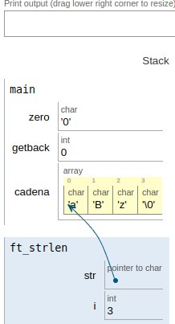
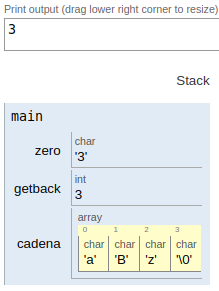

|||
|:--|:--|
|ft_strlen||
|Files to turn in : ft_strlen.c||
|Allowed functions : none||

 

- Write a function that displays the number of characters.

- Write a `ft_div_mod` function that has the following prototyping:

<pre> int  ft_strlen(char *str);</pre>

### Operation:

- The purpose of this function is to display the number of characters in a string.

- In the main function we declare a variable of type character and assign the character equivalent to the number zero.
- We declare a variable of integer type and equate it to 0
- We declare a variable of type character but that is a string of characters assigning characters in double quotes
When calling the function, we pass in the argument the variable with the string of characters

- As in the declaration of the function the parameter is a pointer of type character `*str`, automatically we have the address to which corresponds the segment of memory where that string of characters begins

- Within the function we declare a variable of integer type `i` that will make us the function of character counter.

- Through a loop of type while and the condition  `while (str[i] != '\0')` that it must continue until it finds the end of the string the loop iterates, when it reaches the end the value is returned to the function by `return (i)`;

- returning the value and adding it to the zero variable, obtaining a value ranging from 1 to 9 to be printed on the screen.

 

|||
|:-|:-|
|code||
|<pre>   #include <unistd.h>  void  ft_putchar(char c);  int   ft_strlen(char *str);  int main(void) {    char zero;     zero = '0';        int getback;    getback = 0;         char  cadena[] = "aBz";    getback = ft_strlen(cadena);       zero = zero + getback;    write(1,&zero,1);         return (0); }   int   ft_strlen(char *str) {     int   i;     i = 0;         while (str[i] != '\0')     {       str[i];        i++;     }     return (i); }  void  ft_putchar(char c) {    write(1,&c,1);   } </pre> |   |
