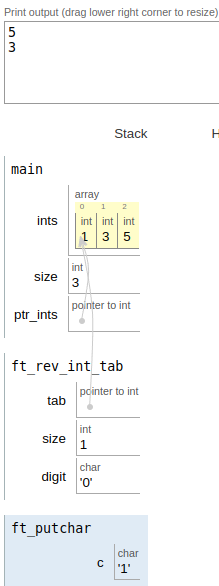

|||
|:--|:--|
|ft_rev_int_tab||
|Files to turn in : ft_rev_int_tab.c||
|Allowed functions : ninguna||

 

- Write a function that reverses the order of the elements of an array of integers.

- The parameters are a pointer to integer and the number of integers in the array. 

- The function should be prototyped as follows:

<pre>  void ft_rev_int_tab(int *tab, int size);</pre> 

### Operation:
- We are asked to display the contents of the integer type array in reverse.
- The first thing we have to do is know the length of our array by doing and we do it by the difference between the last position occupied by our array of integer type and the first.
- Once we know what it measures, we go through the array in reverse until we reach the beginning.

|||
|:-|:-|
|code||
|<pre>   #include <stdio.h>   #include <unistd.h>   #include "ft_putchar.c"      /*- Function that reverses the order of the elements of an array of integers.*/   void  ft_rev_int_tab(int *tab, int size);     int main(void)   {      int ints[] = {1,3,5};     int size;      int *ptr_ints;      ptr_ints = ints;        size = *(&ints + 1) - ints; /* size array */         ft_rev_int_tab(ints, size); /*call func*/   }     void  ft_rev_int_tab(int *tab, int size)   {      char digit;      digit = '0'; /* char as offset to show numbers by write*/      while (size != 0) /*condition for loop; while size different 0*/      {         ft_putchar(tab[size-1] + digit);   size--;  write(1,"\n",1);      }  } </pre> ||
