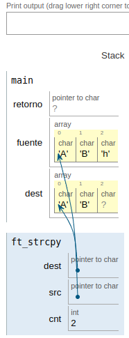

|||
|:--|:--|
|ft_strcpy.c||
|Files to turn in : ft_strcpy.c.c||
|Allowed functions : |none|

 

- Reproduce the behavior of the function strcpy (man strcpy).
- The function should be prototyped as follows:

<pre>  char *ft_strcpy(char *dest, char *src);</pre> 

### Operation:

- To reproduce the behavior of the function, the first thing we have to take into account is that both the array of input and output characters has to have the same dimension or at least that the output is greater than the input.

- We pass the character arrays as arguments to the function.

- In the function space the pointers point to the beginning of the character arrays.

- We initialize a counter and make a loop while traverse the array of characters from the beginning until the value of the counter is equal to the one we have set as the dimension of the array.

- When leaving the while and with the last value of the counter we enter the character that represents the end of an array of characters.

- Finally we return to the main function the memory position of the array of characters that we have copied.

- we show on screen the content of the array with the length that we have previously defined in the symbolic constant SIZE.

|||
|:-|:-|
|code||
|<pre>   #include <unistd.h>  int main(void)  {     char *retorno;     char  fuente[size]="ABh";     char  dest[size];       retorno = ft_strcpy(dest, fuente);      write(1, retorno, SIZE);     write(1, "\n", 1);     return (0);  }    char *ft_strcpy(char *dest, char *src)  {     int cnt;     cnt = 0;      while (cnt != SIZE)     {        dest[cnt] = src[cnt];        ++cnt;     }     dest[cnt] = '\0';     return (dest);  } </pre> | [strcpy1.png](strcpy1.png)|
